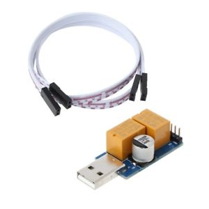

china usb mining watchog
=====================

if you got one of these :



here is the reverse engineered "protocol":

```
9600 baud

init sequence: 0x00 0x80 0x81
keep alive:    0x00 0x01
where 0x01 is 10 seconds timeout. higher number is longer timeout
reset now:     0x00 0xff
```


to use my code:

```
git clone git@github.com:aep/usb-mining-watchdog-china.git wd
cd wd
cargo install
~/.cargo/bin/miningwd /dev/ttyUSB0
```

every "ping" output should make the led blink.
kill the program to initiate the timeout reset sequence


